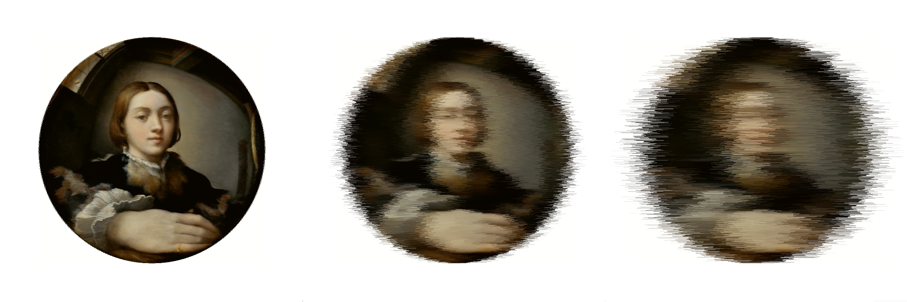

# CNVXR



Three versions of _Self-portrait in a convex mirror_ with a little help from `cnvxr`.

## Installation

```bash
npm install
npm link
```

## Usage

```bash
cnvx \
	--input=path/to/input.image \
	--output=path/to/output.png \
	--factor=1 \
```

The `factor` commmand is required and determines how much to "blur" the image. Larger values yield greater blurs.
